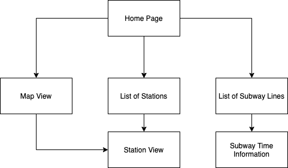
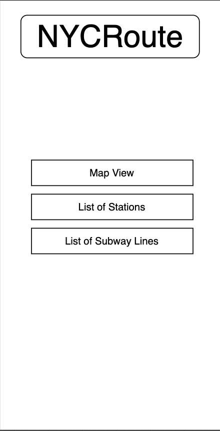
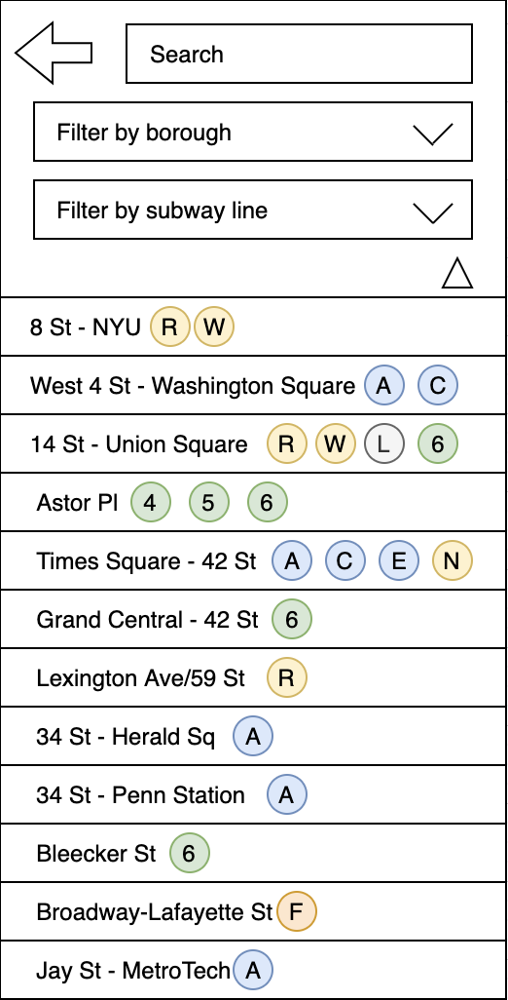
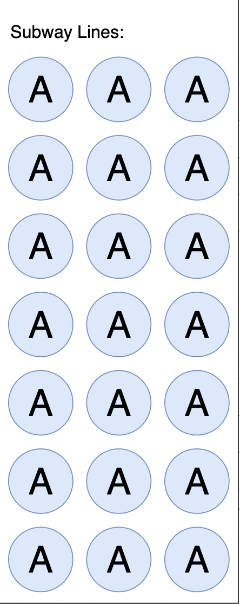
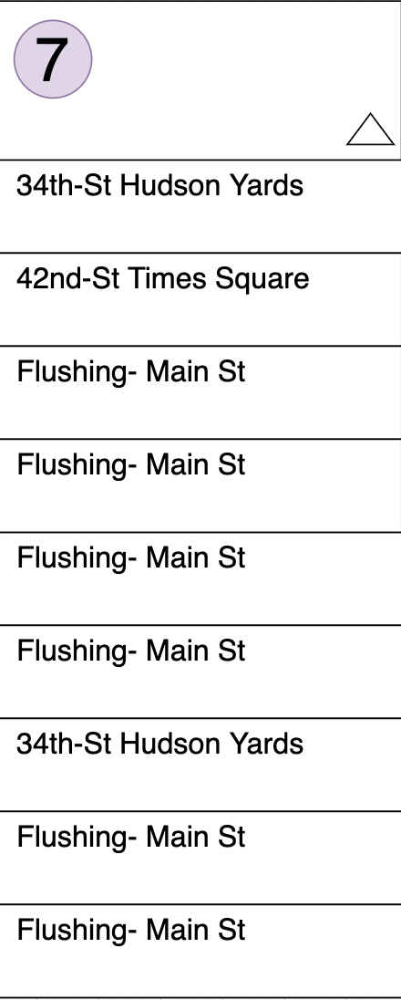
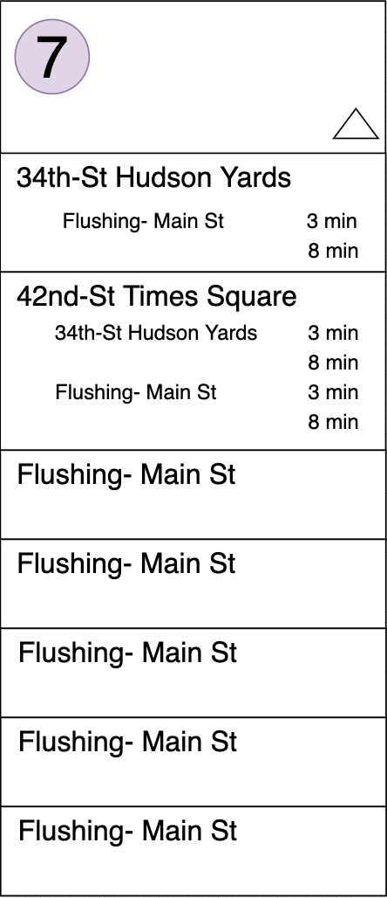

# User Experience Design
## Prototype
The [link](https://invis.io/HU11VKGEE9YF) to the prototype made with invision.

---
## App Map

---
## WireFrame
### Home Page

The home page has three links to the 3 pages
* Map View
* List of Stations
* List of Subway Lines

### Map View

Here, a map would be displayed that allows the user to choose a station. 
This map would be dynamic.

### List of Stations

This page will give a list of all available stations with functionality to search, and filter by borough or subway line available at the station

Clicking on a station will lead to that station's information page, Station Subway View

### Station Subway View

This is the page displayed after picking a station from either the map view or the station list view. 

This will display all the trains that stop at the station and the times for both uptown and downtown trains of each of those subway lines. 

### List of Subway Lines

This is the Subway Line view from the home page that lists all the Subway Lines in NYC. Here, the user can choose a line and this will send them to the Subway-Station View

### Subway-Stations View

This is the page displayed after choosing from the Subway Line List. It lists all the stations that the certain lines go to. 

The arrow allows you to reverse the list to get the reverse direction listing of stations, which will list stations from first to last stop. 

When a station is clicked on, it will expand to show the train times for trains bound in either direction.

### Reverse Subway Station View

Here, the list of the stations that the chosen subway line stops at is listed in the reverse order in which they were listed before. 

### Expanded Subway Station View

This page is when a user clicks on a specific station. This will display the train times at that station for both direction bound trains.
